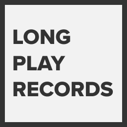
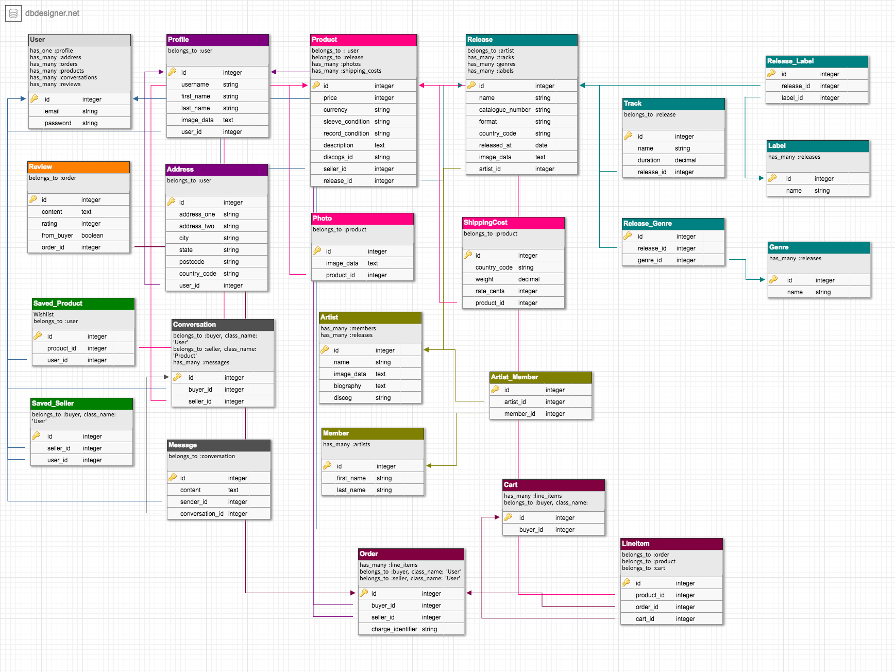
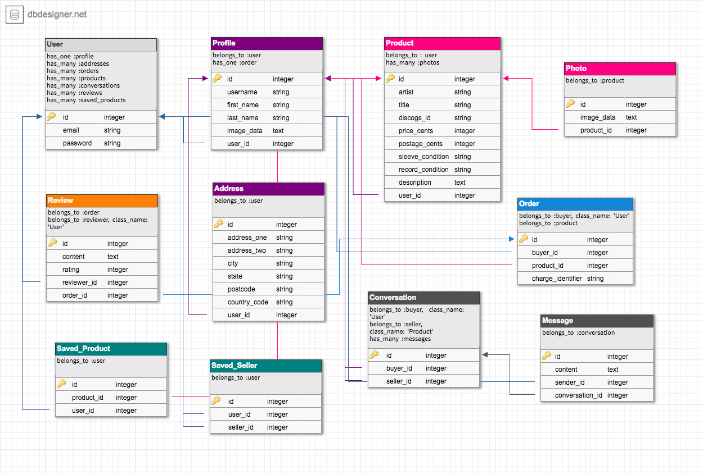
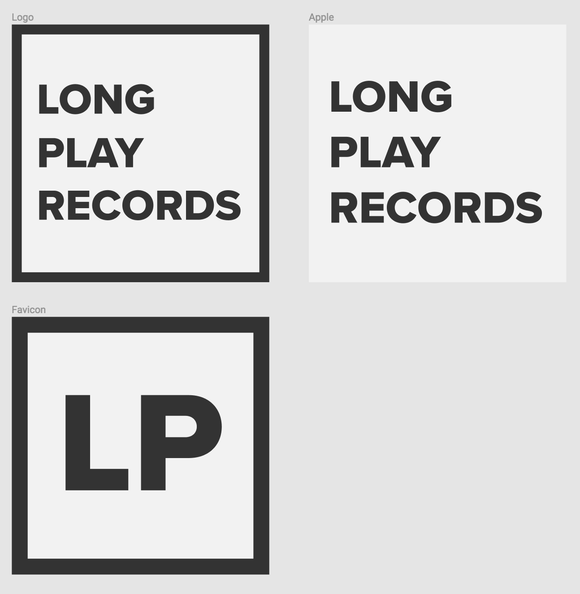
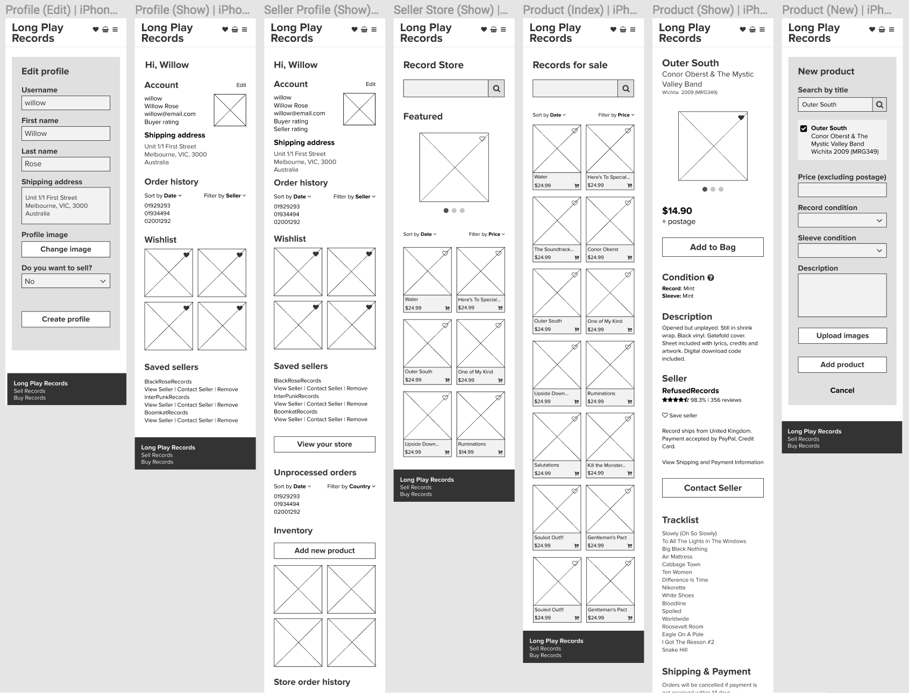
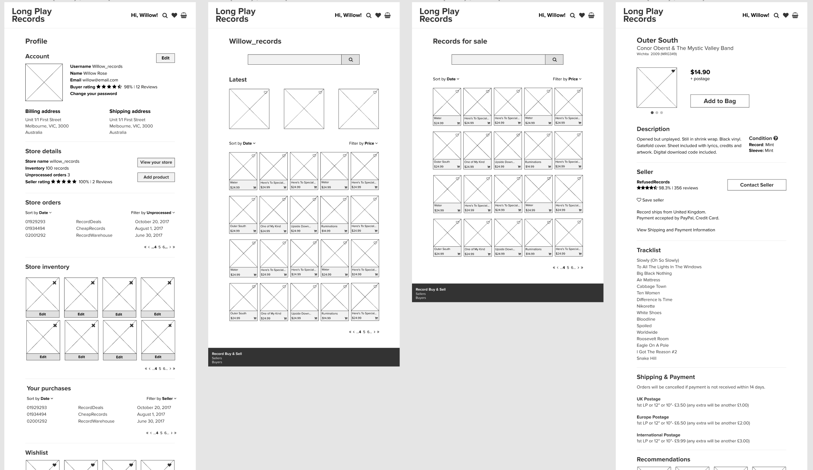

# Long Play Records

A two-sided marketplace to buy and sell secondhand vinyl records.



## Table of Contents
- [Getting started](#getting-started)
  - [Prerequisites](#prerequisites)
  - [Installation](#installation)
- [Problem](#problem)
- [Solution](#solution)
- [Planning and Design](#planning-and-design)
  - [Planning](#planning)
    - [Audience](#audience)
    - [User stories](#user-stories)
      - [Buyers](#buyers)
      - [Sellers](#sellers)
      - [Buyers and Sellers](#buyers-and-sellers)
    - [Entity Relationship Diagram](#entity-relationship-diagram)
      - [Version One](#version-one)
      - [Version Two](#version-two)
  - [Design](#design)
    - [Moodboard](#moodboard)
    - [Logo](#logo)
    - [Wireframes](#wireframes)
      - [Mobile](#mobile)
      - [Desktop](#desktop)
- [Development](#development)
  - [Technologies](#technologies)
    - [APIs](#apis)
    - [Gems](#gems)
  - [Project tasks](#project-tasks)
- [Acknowledgments](#acknowledgments)

## Getting started

These instructions will get you a copy of the project up and running on your local machine for development purposes.

### Prerequisites
```
Ruby 2.4.1
Rails 5.1
PostgreSQL
Amazon S3 Cloud Storage
```

### Installation

Clone the repo
```
git clone https://github.com/julia-/long-play-records.git
```

Install gems
```
bundle install
```

Create `.env` file and add environment variables

Create Database
```
rails db:create
```

Migrate tables
```
rails db:migrate
```

Start server
```
rails server
```

Open your chosen browser and navigate to http://localhost:3000.

## Problem
In recents years vinyl records have dramatically increased in popularity with a 25 year high in sales reached in 2016 - even outselling digital music. Many new releases are available on vinyl and even older releases are now also being reissued on vinyl. With the increased popularity of vinyl and related events such as Record Store Day and record fairs, there is a greater demand for online shopfronts to facilitate the buying and selling of new, used and collectible records. With the exception of large, international sites such as Discogs, or non-specialist sites such as eBay there is little in the way of sites that focus on the secondhand and collectible record trade.

## Solution
Develop a two-sided marketplace rails application to enable people to buy and sell secondhand vinyl records.

## Planning and design

### Planning
To deliver what I had envisioned I decided to look at incorporating an API where I could pull in most information

#### Audience
- Music lovers
- Fans of vinyl
- Collectors
- Records stores
- Musicians/DJs
- Lovers of secondhand goods

#### User stories
##### Buyer
1. In order to find all records by a specific artist, as a fan, I want to be able to search by an artist’s name.
2. In order to find all records an artist has made (including associated acts), as a fan, I want to see a list of all records the artist has been involved with when searching for the artist.
3. In order to find records under $20, as a buyer, I want to be able to filter by price.
4. In order to find a specific record, as a buyer, I want to be able to search by title.
5. In order to see what’s new, as a buyer, I want to be able to see a list of all recent additions.
6. In order to feel confident about what  am buying, as a buyer, I want to be able to read reviews about the seller.
7. In order to see what punk records are available for sale, as a buyer, I want to be able to limit my search by genre.
8. In order to buy a record, as a one off buyer, I want to be able to buy without creating a profile.
9. In order to buy a record at the lowest price, as a buyer, I want to be able to compare with other records.
10. In order to only see records in good condition, as a buyer, I want to be able to filter results by condition.
11. In order to select multiple records to buy later, as a buyer, I want to be able to create and save a list of records.
12. In order to not miss out on a record that’s been recently added, as a collector, I want to receive an email notification.
13. In order to feel confident my purchase was successful, as a buyer, I want to receive an email confirmation.
14. In order to see what I've previously bought, as a buyer, I want to be able to see past orders.
15. In order to go back to sellers pages that sell records I like, as a buyer, I want to be able to favourite sellers.
16. In order to see other releases by the record label, as a buyer, I want to list of suggested purchases from the label.
17. In order to buy one record quickly, as a buyer, I want to be taken straight to the checkout page.
18. In order to feel confident about the records condition, as a buyer, I want to be able to see several photos of the record.
19. In order to be able to ask the seller questions, as a potential buyer, I want to be able to message the seller.
20. In order to view conversations with sellers, as a buyer, I want to be able to view all conversations.
21. In order to share my experience, as a buyer, I want to be able to provide feedback on the site.
22. In order to return an item, as a buyer, I want to be able to find information about returns.
23. In order to keep adding items to my shopping cart, as a buyer, I want to not be directed to the shopping cart each time I add an item.
24. In order to see what I've previously bought, as a buyer, I want to be able to see past orders.
25. In order to see other releases by a label, as a buyer, I want to search view the labels other releases from the record I am looking at.
26. I want to be able to favourite certain sellers I like or see a list of sellers I've bought from before.
27. In order to see what I've previously bought, as a buyer, I want to be able to see past orders.
27. In order to see what I've previously bought, as a buyer, I want to be able to see past orders.
28. In order to know when new stock has been added, as a buyer, I want to be alerted by an email notification.

##### Seller
1. In order to quickly add items to my inventory, as a seller, I want to be able to populate fields through a database.
2. In order to provide buyers with as much information about the record, as a seller, I want to be able to add a description and information about the condition, price, postage, returns for the record.
3. In order to make sure I process a new order asap, as a seller, I want to be notified when new orders has been placed.
4. In order to let the buyer know if there is a delay or a problem, as a seller, I want to be able to contact the buyer.
5. In order to see all orders that have been placed for the year, as a seller, I want to be able to filter past orders.
6. In order to only see unprocessed orders, as a seller, I want to be able to mark completed orders.
7. In order to be seen as a trusted seller, as a seller, I want customers to be able to rate and review the service.
8. In order to organise the records I am selling, as a seller, I want to be able to assign genres/styles to each record.
9. In order to receive payment for each sale, as a seller, I want payments to be done through stripe, PayPal.
10. In order to promote certain records, as a seller, I want to be able feature items.

##### Buyer/Seller
1. In order to sell and buy records, as a collector, I want to use the same account for selling and buying.
2. In order to keep my buying and selling separate, as a collector, I want to have different views for selling and buying.

#### Entity Relationship Diagram
During development I revised the ERD by removing several models and instead, displaying data from the Discogs API and only saving the necessary data from API calls.

- [ERD v1](https://dbdesigner.net/designer/schema/125555)
- [ERD v2](https://dbdesigner.net/designer/schema/122698)

##### Version 1


##### Version 2


### Design
I began the design process by exploring online music stores to gain inspiration and ideas about how to present content. I also used this time to see what these sites are doing that could be improved in Long Play Records.

- [Amoeba Music](http://www.amoeba.com)
- [Banquet Records](https://www.banquetrecords.com)
- [Discogs](https://www.discogs.com)
- [Boomkat Records](https://boomkat.com)
- [InterPunk](http://www.interpunk.com)
- [Red Eye Records](https://www.redeye.com.au)

Most sites that I reviewed had a dated and chaotic design that was distracting and had no clear path for the site's visitors.

I draw inspiration in my designs from [Banquet Records](https://www.banquetrecords.com) and in particular [Boomkat records](https://boomkat.com) which has a simple, understated and modern design. Boomkat's user experience is intuitive as the content is displayed progressively. The site does not overwhelm the visitor with content but at the same time was able to provide comprehensive information for each item.

I wanted to create an experience that featured the cover art to gain the visitor's attention. I wanted the design to be reminiscent of a record store with the walls lined with records
My goal was to design and build a portfolio site that was striking, unique and memorable while still being simple and minimal in design. My design needed give content and function priority - the design needed to support and not distract from the purpose of the site. My ultimate goal was to surprise and provide a fun experience for the viewer without overwhelming them.

#### Moodboard


[Moodboard | Long Play Records](https://www.pinterest.com.au/juliaryanx2645/long-play-records-mood-board)

#### Logo



[Logo & Favicon | Long Play Records](https://www.figma.com/file/I37qPPGFPntrRoBPT4SHr8TW/Long-Play-Records-Logo-and-Favicon)

#### Mobile wireframes

[Mobile wireframes | Long Play Records](https://www.figma.com/file/MTmF3gVizwjaZq6ULLUkgClG/Long-Play-Records-Mobile)

##### Mobile wireframes sample


#### Desktop wireframes

[Desktop wireframes | Long Play Records](https://www.figma.com/file/E6mIy4ZOZSxJns8WURVAoa/Long-Play-Records-Desktop)

##### Desktop wireframes sample


## Development

### Technologies used
```
Ruby 2.4.1
Rails 5.1
PostgreSQL
Amazon S3 Cloud Storage
```
#### API
[Discogs API](https://www.discogs.com/developers)

#### Gems
```ruby
gem 'dotenv-rails'
gem 'devise'
gem 'pundit'
gem 'aws-sdk', '~> 3'
gem 'bootstrap', '~> 4.0.0.beta2.1'
gem 'jquery-rails'
gem 'fastimage'
gem 'image_processing'
gem 'mini_magick'
gem 'shrine'
gem 'httparty'
gem 'font-awesome-rails'
gem 'money'
gem 'kaminari'
gem 'stripe'
gem 'mailgun-ruby', '~>1.1.6'
gem 'meta-tags'
```

### Project tasks

- [x] PostgreSQL Database
- [x] API
- [x] Gems
- [x] Environmental variables
- [x] Transactional emails
- [x] Internal user messaging system
- [x] Searching capability
- [x] Sorting capability
- [x] Filtering capability
- [x] File uploading
- [x] Authentication
- [x] Authorisation
- [ ] Admin dashboard (optional)
- [x] README

## Acknowledgments
[Discogs API](https://www.discogs.com/developers)

[Vinyl record by Aidan Cooke from the Noun Project](https://thenounproject.com/term/vinyl-record/1138317)

Long Play Records was designed and developed for Coder Academy's Term Two Major Project.
